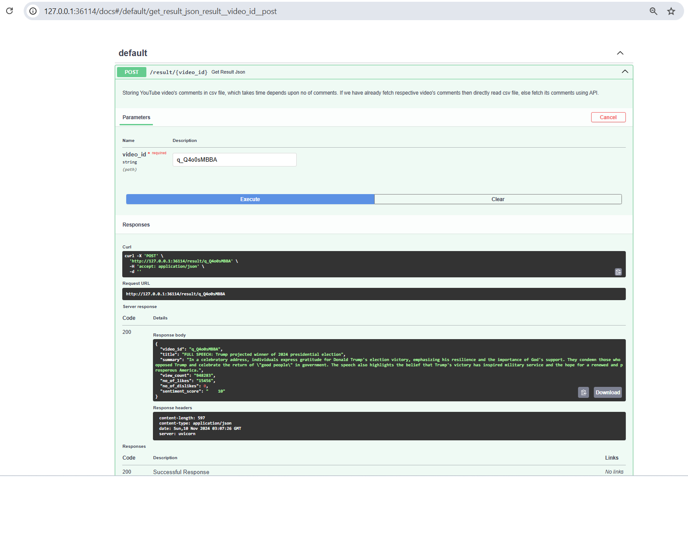
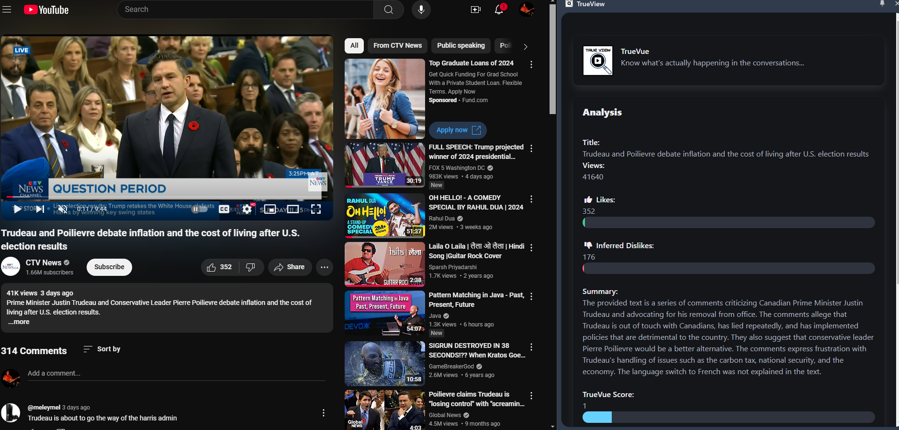

# Prerequisites
1. pip install virtualenv
2. virtualenv <your-env>
3. <your-env>\Scripts\activate
4. <your-env>\Scripts\pip.exe install google-api-python-client

# Run Service Swagger

1. Directly run python main.py file.
2. Open link: http://127.0.0.1:36114/docs in browser

# Swagger Fast API Output

# Results

# TrueView - YouTube Sentiment Analysis Extension

## Inspiration

As an avid YouTube viewer, I often encounter videos that feel misleading or poorly received by other viewers. With YouTube hiding dislike counts, I wondered if others shared my sentiments but found it challenging to gauge the overall opinion amidst hundreds of comments. Sometimes, I wanted feedback on specific topics but got lost in a sea of unrelated comments. This inspired the creation of TrueView—a tool to reveal real viewer sentiments and filter comments based on topics of interest.

## What It Does

TrueView is a browser extension that brings transparency to YouTube by uncovering the true sentiment behind video content. Here’s how it transforms the viewing experience:

- **Uncovers True View**: Analyzes YouTube comments on a 1-to-10 scale, capturing a spectrum of viewer opinions from highly negative to extremely positive.

- **Fills the Dislike Gap**: With YouTube’s dislike count hidden, TrueView estimates dislikes based on negative comments, helping viewers gauge content quality.

- **Provides Engagement Insights**: Displays core engagement metrics (view count, likes, estimated dislikes) and combines this data with sentiment analysis to offer a complete picture of viewer interaction.

- **Real-Time Sentiment Insights**: Integrated side panel provides real-time sentiment and engagement statistics without disrupting the video experience.

 

TrueView empowers viewers with actionable insights, helping them make informed viewing choices and enhancing their YouTube experience.

 

## Features

## True View Score:
1 = Extremely abusive, harmful, discriminatory, or threatening comments.
5 = Neutral or mildly critical comments, offering constructive criticism or general feedback.
10 = Highly positive, supportive, encouraging, or kind comments.

- **Real-Time Comment Analysis**

  - **Sentiment Scaling**: Analyzes viewer sentiment on a 1-to-10 scale for nuanced feedback.

  - **Abuse Detection**: Flags harmful comments, helping filter out negative content.

 

- **On-the-Go Sentiment Analysis**

  - **Instant Sentiment Insights**: Displays real-time sentiment insights directly on the YouTube video screen.

  - **Dislike Estimation**: Estimates dislikes based on negative comment ratios to provide an idea of video reception.

 

- **In-Depth Video Statistics**

  - **Engagement Metrics**: Fetches view count, likes, and estimated dislikes for a quick performance snapshot.

  - **Comparative Insights**: Analyzes comment sentiment alongside engagement metrics to understand content impact.

 

- **Seamless YouTube Integration**

  - **Embedded Side Panel**: Integrated within YouTube for easy access to insights.

  - **Auto-Fetch on Video Load**: Automatically detects and analyzes new videos for up-to-date information.

 

## How We Built It

 

- **Service-Oriented Design**: Modular approach with independent components for data retrieval, sentiment analysis, summarization, and UI, ensuring scalability and flexibility.

- **Optimized Data Flow**: Content and background scripts manage data capture and processing, keeping user interactions responsive.

- **Data Retrieval**: Efficient API usage for fetching video metadata, comments, and engagement stats, with caching and error handling.

- **Scalable Sentiment Analysis Pipeline**: VADER Sentiment Analysis and LangChain-powered scoring capture nuanced viewer sentiment.

- **Advanced Summarization**: Uses Google’s Gemini Pro language model to condense comment threads into insightful summaries.

- **Real-Time UI Updates**: Structured message passing keeps insights updated in the side panel for a smooth user experience.

- **Responsive UI**: An intuitive, production-ready side panel delivers insights in a visually appealing, user-friendly format.

 

This architecture allows TrueView to scale effortlessly, handle high data volumes, and provide valuable insights in real time.

 

## Challenges We Ran Into

 

- **Extension Development**: Learning Chrome extension architecture, sentiment analysis, and handling technical constraints within a limited time was challenging.

- **Module Integration**: Connecting the front-end and back-end in a short time required careful coordination.

- **Resource Constraints**: The Google Cloud API service faced limitations, leading to resource exhaustion when processing large comment datasets.

 

## Accomplishments

 

- Successfully developed and deployed a fully functional Chrome extension in a short time.

- Created a tangible solution that enhances the YouTube viewing experience with meaningful insights.

- Kept front-end and back-end as separate, scalable modules following industry standards.

- Connected the Chrome extension module with FastAPI for seamless data handling.

 

## What We Learned

 

This project taught us the nuances of building an interactive Chrome extension. We gained experience in sentiment analysis and integrating complex NLP tools within a user-friendly interface.

 

## What's Next for TrueView

 

TrueView is evolving, with exciting features planned for even deeper insights:

 

1. **Topic-Wise Comment Filtering**: Filter comments by specific topics to focus on feedback related to particular aspects of the video.

2. **Semantic Search by Dialogue**: Search for specific topics or phrases in the video to locate exact moments where those discussions occur.

3. **Enhanced Content Filtering and In-Depth Analysis**: Further refining content filtering for more detailed sentiment analysis and engagement patterns.

 

With these enhancements, TrueView aims to become the go-to tool for YouTube insights, providing a more granular understanding of video content and audience reactions. Stay tuned for updates!

 

---

 

TrueView browser extension offers a richer, more informative YouTube experience, empowering users to make data-driven viewing decisions and helping creators understand audience feedback more effectively.